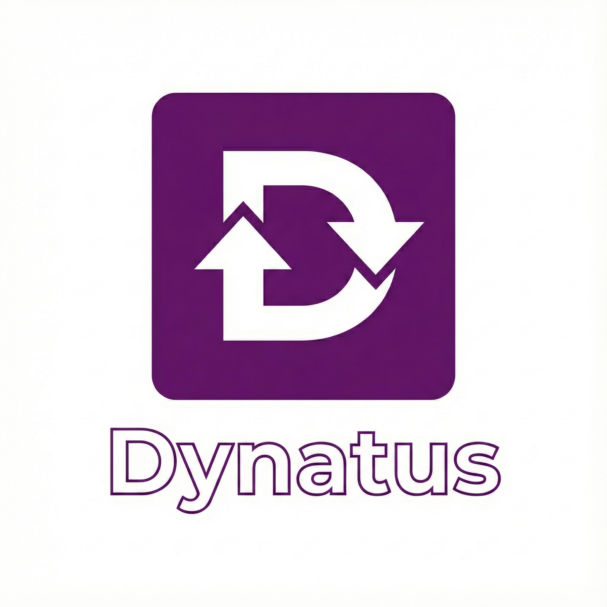

<div align="center">
  
  
  # Dynatus

  [](https://github.com/MoritaHR/dynatus/actions/workflows/ci.yml)
  [](https://github.com/MoritaHR/dynatus/actions/workflows/test.yml)
  [](https://clojars.org/org.clojars.morita/dynatus)
  []

  **A Clojure library for managing DynamoDB table migrations and keeping table definitions in sync between local and production environments.**
</div>

---

Highly inspired in migratus and how it is easy to use it. 

## Features

- 📦 EDN-based table definitions
- 🔄 Automatic table creation and updates
- 🐳 Testcontainers support for integration testing
- 🏠 Local DynamoDB support via interceptors
- ⚡ Simple API for migrations

## Installation

Add to your `deps.edn`:

```clojure
;; From Clojars
{:deps {org.clojars.morita/dynatus {:mvn/version "0.1.0-beta"}}}

;; Or from GitHub
{:deps {dynatus/dynatus {:git/url "https://github.com/MoritaHR/dynatus"
                          :git/sha "LATEST_SHA"}}}
```

## Usage

### Basic Migration

```clojure
(require '[dynatus.core :as dynatus]
         '[cognitect.aws.client.api :as aws])

;; Create a DynamoDB client using AWS SDK
(def dynamo-client (aws/client {:api :dynamodb
                                :region "us-east-1"}))

;; Run migrations from resources/dynamo directory
(dynatus/migrate {:client dynamo-client
                  :path "resources/dynamo"})
```

The library is designed to work with any Cognitect AWS DynamoDB client, giving you full control over client configuration.

### Table Definition Format

Create `.edn` files in your migrations directory:

```clojure
;; resources/dynamo/users.edn
{:TableName "users"
 :KeySchema [{:AttributeName "user_id"
              :KeyType "HASH"}]
 :AttributeDefinitions [{:AttributeName "user_id"
                         :AttributeType "S"}
                        {:AttributeName "email"
                         :AttributeType "S"}]
 :BillingMode "PAY_PER_REQUEST"
 :GlobalSecondaryIndexes [{:IndexName "email-index"
                           :KeySchema [{:AttributeName "email"
                                        :KeyType "HASH"}]
                           :Projection {:ProjectionType "ALL"}}]
 :StreamSpecification {:StreamEnabled true
                       :StreamViewType "NEW_AND_OLD_IMAGES"}
 :Tags [{:Key "Environment"
         :Value "production"}]}
```

### Local Development

For local development, you can configure your AWS client to connect to local DynamoDB:

```clojure
(require '[cognitect.aws.client.api :as aws]
         '[cognitect.aws.interceptors :as interceptors])

;; Define interceptor for local DynamoDB
(defmethod interceptors/modify-http-request "dynamodb"
  [service http-request]
  (-> http-request
      (assoc :scheme :http
             :server-port 8000
             :server-name "localhost")
      (assoc-in [:headers "host"] "localhost:8000")))

;; Create client - interceptor will redirect to local
(def local-client (aws/client {:api :dynamodb
                               :region "us-east-1"}))
```

### Testing with Testcontainers

```clojure
(require '[dynatus.test-fixtures :as fixtures])

(use-fixtures :each fixtures/with-dynamodb-container)

(deftest my-test
  (testing "DynamoDB operations"
    ;; Use fixtures/*test-client* which is automatically connected
    ;; to a DynamoDB container
    (let [client fixtures/*test-client*]
      ;; Your test code here
      )))
```

## Running Tests

```bash
# Run all tests
clojure -M:test -m kaocha.runner

# Run with specific test
clojure -M:test -m kaocha.runner --focus dynatus.core-test
```

## Project Structure

```
dynatus/
├── deps.edn                 # Dependencies
├── project.clj              # Leiningen configuration
├── src/
│   └── dynatus/
│       ├── core.clj        # Main migration logic
│       ├── loader.clj      # Table definition loader
│       ├── diff.clj        # Table comparison logic
│       └── apply.clj       # Apply migrations
├── test/
│   └── dynatus/
│       ├── core_test.clj      # Integration tests
│       ├── test_fixtures.clj  # Testcontainers setup
│       └── test_client.clj    # Test-specific client with interceptors
└── resources/
    └── dynamo/             # Table definitions
        ├── users.edn
        └── orders.edn
```

## Environment Variables

- `IN_DOCKER` - Set to "true" when running in Docker
- `DYNAMODB_LOCAL_ENDPOINT` - Override local DynamoDB endpoint
- `AWS_PROFILE` - AWS profile for credentials

## Building and Deployment

### Build JAR

```bash
# Build the JAR file (using Leiningen)
lein jar

# Or using deps.edn
clojure -X:jar

# This creates target/dynatus.jar
```

### Install Locally

```bash
# Install to local Maven repository (~/.m2) using Leiningen
lein install

# Or using deps.edn
clojure -X:install
```

### Deploy to Clojars

Deployment is handled through GitHub Actions when you create a new release tag.

#### Automated Deployment (Recommended)

1. Set up GitHub secrets:
   - `CLOJARS_USERNAME`: Your Clojars username
   - `CLOJARS_TOKEN`: Your Clojars deploy token

2. Create and push a version tag:
   ```bash
   git tag v0.1.0-beta
   git push origin v0.1.0-beta
   ```

3. GitHub Actions will automatically deploy to Clojars

#### Manual Deployment

If you need to deploy manually:

```bash
# Set environment variables
export CLOJARS_USERNAME=your-username
export CLOJARS_PASSWORD=your-deploy-token

# Deploy using Leiningen
lein deploy clojars
```

### Using as a Dependency

Once deployed to Clojars:

```clojure
;; deps.edn
{:deps {org.clojars.morita/dynatus {:mvn/version "0.1.0-beta"}}}

;; Leiningen project.clj
[org.clojars.morita/dynatus "0.1.0-beta"]
```

## CI/CD

### Continuous Integration

The project uses GitHub Actions for automated testing and deployment:

#### Test Workflows

**`ci.yml`** - Lightweight CI for every push/PR
- Runs tests on Java 11 and 17
- Caches dependencies for faster builds
- Provides quick feedback on code changes

**`test.yml`** - Comprehensive test suite
- Tests against Java 11, 17, and 21
- Runs linting with clj-kondo
- Checks code formatting with cljfmt
- Uploads test artifacts for debugging

#### Deployment Workflow

**`deploy_clojars.yml`** - Automated deployment
- Triggers on version tags (e.g., `v0.1.0-beta`)
- Uses Leiningen for building and deployment
- Automatically updates version in project.clj if needed
- Creates GitHub releases with installation instructions
- Requires `CLOJARS_USERNAME` and `CLOJARS_TOKEN` secrets

### Running Tests Locally

```bash
# Run all tests
make test

# Run tests with specific Java version
JAVA_HOME=/path/to/java11 make test

# Run with verbose output
clojure -M:test -m kaocha.runner --reporter documentation

# Run specific test namespace
clojure -M:test -m kaocha.runner --focus dynatus.core-test
```

### Making a Release

#### Automated Release (Recommended)

1. Commit your changes: `git commit -am "Prepare release v0.1.0-beta"`
2. Tag the release: `git tag v0.1.0-beta`
3. Push with tags: `git push origin main --tags`
4. GitHub Actions will automatically:
   - Build the JAR using Leiningen
   - Deploy to Clojars with proper credentials
   - Create a GitHub release with installation instructions

#### Manual Release

You can also trigger a deployment manually from GitHub Actions:
1. Go to Actions → Deploy to Clojars
2. Click "Run workflow"
3. Enter the version number (e.g., `0.1.0-beta`)
4. Click "Run workflow"

### Setting up GitHub Secrets

For automated deployment, configure these secrets in your GitHub repository:

1. Go to Settings → Secrets and variables → Actions
2. Add the following secrets:
   - `CLOJARS_USERNAME`: Your Clojars username
   - `CLOJARS_TOKEN`: Your Clojars deploy token (get from [Clojars → Deploy Tokens](https://clojars.org/tokens))

### Deployment Action

This project uses GitHub Actions with Leiningen for automated Clojars deployment:
- Handles authentication with Clojars using environment variables
- Publishes the JAR with proper metadata
- Supports both release and snapshot versions
- Automatically updates version in project.clj if needed
- Creates GitHub releases with proper installation instructions

The library includes a GitHub Actions workflow for automatic deployment to Clojars when a new release tag is created.

## License

Copyright © 2025 MoritaHR

Distributed under the MIT License.